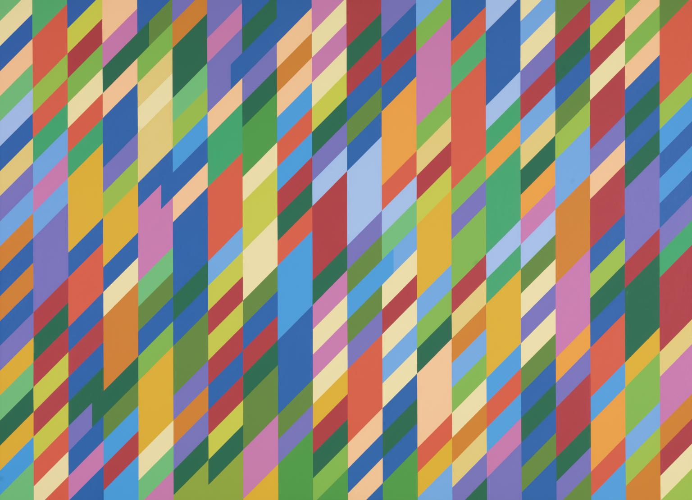

# Processing-Generative-Art

Arte Generativa escrito em Java/Processing inspirado no trabalho Nataraja de Bridget Riley

# Bridget Riley e Nataraja

Bridget Riley, nascida em 1931, é uma renomeada artista britânica conhecida por suas contribuições significativas para o movimento da op art. A sua abordagem inovadora e técnica precisa a tornaram uma figura influente na arte do século XX. Desde o início da sua carreira, Riley demonstrou um interesse profundo na interação entre cor, forma e perceção, explorando como esses elementos podem criar ilusões de movimento e dinamismo visual.

Ao longo da sua trajetória, Riley desenvolveu um estilo distintivo que se tornou sinónimo da op art, caracterizado pelo uso de padrões geométricos repetitivos e a manipulação cuidadosa de cores para criar efeitos óticos cativantes. A sua obra "Nataraja", criada em 1993, exemplifica a sua habilidade em empregar esses elementos de forma magistral. Nesta pintura vibrante, Riley reinterpreta a dança cósmica de Shiva, traduzindo-a para um contexto visual contemporâneo por meio de linhas e formas dinâmicas que desafiam e envolvem o espetador.

Riley não apenas dominou a estética visual nas suas obras, mas também explorou a interação entre arte e ciência, colaborando com psicólogos e neurocientistas para compreender melhor como o cérebro humano percebe e processa o movimento visual. O seu trabalho influenciou gerações de artistas e continua a inspirar aqueles interessados na interseção entre arte, perceção e tecnologia.

A escolha da obra "Nataraja" de Bridget Riley para a exploração em programação multimédia é motivada pela riqueza e profundidade do legado artístico de Riley, bem como pela sua contínua relevância no contexto da arte generativa. A capacidade de traduzir elementos visuais dinâmicos e ilusórios em código oferece uma oportunidade emocionante para explorar e honrar a visão inovadora de Riley, ao mesmo tempo, em que abre novas possibilidades para a expressão artística e interativa.

# Memória Descritiva

## Introdução
Bridget Riley, renomeada artista britânica do movimento op art, deixou um legado impactante que transcende a pintura tradicional. Este documento explora como a sua obra "Nataraja" (1993) serviu como inspiração para um projeto de programação multimédia inovador, destacando a relação entre arte, perceção e tecnologia.

## Descrição da Obra "Nataraja"
"Nataraja" é uma expressão única da visão artística de Riley, reinterpretando a dança cósmica de Shiva num contexto visual contemporâneo. A obra incorpora linhas dinâmicas e formas que desafiam a perceção do observador, criando uma experiência visual envolvente e ilusória. As cores vibrantes e a composição cuidadosamente elaborada são características marcantes dessa peça.

## Conexão com o Projeto de Programação Multimédia
A escolha de "Nataraja" como ponto de partida para o projeto de programação multimédia foi motivada pela riqueza do legado artístico de Riley e pela busca em explorar a interseção entre arte, perceção e tecnologia. A obra serviu como catalisador criativo, orientando a abordagem estética e conceitual do projeto.

## Tradução Visual para o Código
O projeto buscou capturar a essência de "Nataraja" ao utilizar as cores originais da obra, recriando visualmente a paleta de Bridget Riley. Contudo, ao invés de replicar fielmente as formas diagonais, opção foi feita por usar quadrados na sua perspetiva normal. Essa escolha não apenas homenageia a obra original, mas também cria uma conexão visual com as imagens de avatar padrão do GitHub.

## Adição de uma Grid de 16x16 Pixels
Para gerar uma imagem complexa e proporcionar uma experiência visual distinta, uma grid de 16x16 pixels foi incorporada ao projeto. Essa adição não apenas aumentou a complexidade da obra, mas também introduziu uma variedade visual que dialoga com a natureza dinâmica da dança cósmica retratada em "Nataraja."

## Restrição de Cores e Conexão com o Computador
O código foi concebido para funcionar exclusivamente com números correspondentes aos bytes de um computador (1, 8, 16, 32, 64, 128). Essa escolha não apenas estabelece uma ligação simbólica com o próprio computador, mas também enfatiza os temas fundamentais de programação multimédia e arte generativa.

## Funcionalidades Adicionais do Projeto
Além da recriação visual, o projeto incorpora funcionalidades adicionais para enriquecer a experiência do utilizador. Uma função de exportar o ecrã gerado foi implementada, permitindo a preservação e compartilhamento das composições. A capacidade de gerar novas combinações de cores e a introdução de uma paleta de cores aleatória oferecem dinamismo ao projeto, ampliando as possibilidades criativas.

## Experimentação com Formas e Versões Beta
Durante versões beta, foram exploradas novas formas, como círculos e triângulos, geradas aleatoriamente. No entanto, após avaliação, essas adições foram descartadas devido ao impacto visual e à preferência por manter a simplicidade dos quadrados. Isso destaca a importância da experimentação e refinamento no processo criativo.

## Variedade nas Paletas de Cores
O projeto oferece quatro paletas de cores fixas, mantendo uma conexão com a estética original de "Nataraja". Além disso, a introdução de uma quinta paleta que gera cores completamente aleatórias adiciona um elemento de imprevisibilidade, incentivando a exploração e a descoberta de novas combinações.

## Considerações Finais
O projeto de programação multimédia não busca uma mera replicação, mas sim uma interpretação digital e interativa da visão inovadora de Bridget Riley em "Nataraja." Ao explorar a relação entre arte, perceção e tecnologia, o código desenvolvido não só presta homenagem à obra original, mas também expande os limites da expressão artística no contexto digital.
